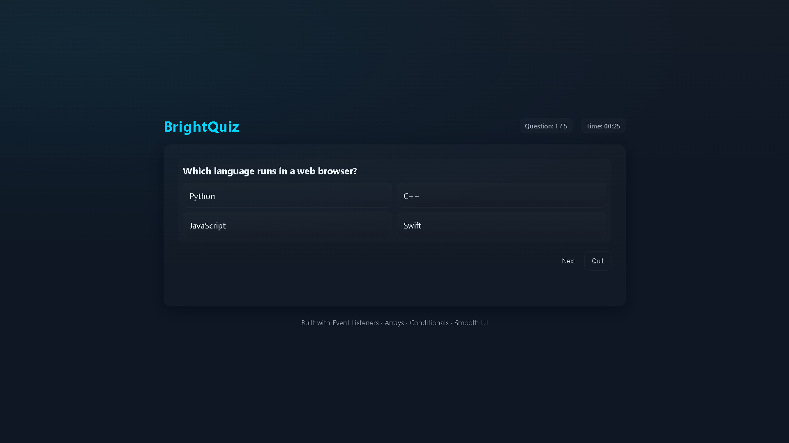
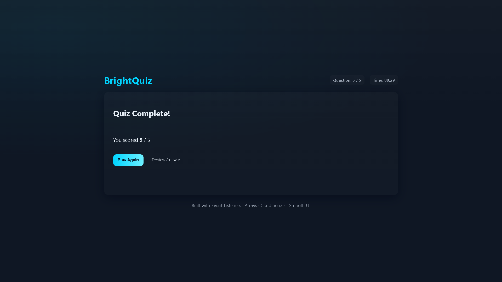

# 🚀 05 - Simple Web Projects: **BrightQuiz** (HTML, CSS, JavaScript)

[](LICENSE)


This is the **fifth project** in the **Simple Web Projects** series — a fully responsive, interactive **Quiz App** built with **pure HTML, CSS, and JavaScript**.

> ⚠️ **Disclaimer:** *“BrightQuiz” is only the project name — it is **not** my personal name.*

---

## ✨ Features

* Multiple-choice quiz questions
* Smooth UI animations and transitions
* Timer for each question
* Score tracking system
* Question progress indicator
* Review answers after submitting
* Keyboard-accessible navigation
* Responsive and modern UI theme

---

## 📸 Screenshots

### Quiz Start Page


### Question Page



### Results Page



---

## 🚀 Getting Started

1. **Clone this repository**

   ```bash
   git clone https://github.com/vishal-git-dot/05-simple-web-projects-html-css-js.git
   ```

2. **Navigate to the project folder**

   ```bash
   cd QuizApp
   ```

3. **Open `index.html` in your browser**

   ```bash
   # No server required
   ```

> No frameworks. No dependencies. Just open the file and run.

---

## 🧠 JavaScript Concepts Used

| Concept                         | Description                            |
| ------------------------------- | -------------------------------------- |
| Arrays                          | Store and cycle through questions      |
| `addEventListener()`            | Handle user clicks and keyboard events |
| DOM manipulation                | Dynamic UI updates                     |
| `setInterval()`                 | Timer countdown logic                  |
| `classList.add/remove/toggle()` | Add styles dynamically                 |
| Template rendering              | Insert questions and answers into HTML |
| Conditionals                    | Validate answers and check correctness |
| Object arrays                   | Store questions, choices, and answers  |

---

## 📚 Project Series Overview

| #     | Project Name              | Skills                       | Features                        |
| ----- | ------------------------- | ---------------------------- | ------------------------------- |
| ✅ 01  | To-Do List App            | DOM, localStorage            | Add/edit/delete tasks           |
| ✅ 02 | Calculator                | Logic, CSS grid              | Basic arithmetic                |
| ✅ 03 | Weather App               | Fetch API, async/await       | City search, weather info       |
| ✅ 04 | Digital Clock             | Time API, intervals          | Live time, dark/light modes     |
| ⭐ 05  | **Quiz App — BrightQuiz** | Events, arrays, conditionals | MCQs, timer, score, review mode |
| 🔜 06 | Image Slider              | CSS transitions, JS controls | Auto-slide, navigation          |
| 🔜 07 | Portfolio Website         | Layout, responsiveness       | About, Projects, Contact        |
| 🔜 08 | Typing Speed Test         | Timers, string logic         | WPM, accuracy tracking          |
| 🔜 09 | Notes App                 | localStorage                 | Add/delete notes                |
| 🔜 10 | Rock, Paper, Scissors     | Conditionals, randomness     | Play vs computer                |

---

## 🛠️ Built With

* **HTML5** — structure & markup
* **CSS3** — animations, variables, responsive layout
* **JavaScript (ES6+)** — quiz logic, timers, DOM updates

---

## 🤝 Contributing

Contributions are always welcome!

* Fork the repo
* Add improvements
* Submit a pull request

If you like this project, please ⭐ star the repo — it helps a lot!

---

## 📄 License

This project is licensed under the **MIT License** — see the [LICENSE](LICENSE) file.

---

Made with ❤️ as part of a self-learning series.
